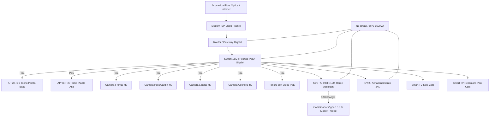

# Arquitectura de Red y Rack Central (MDF)
**Proyecto:** Residencia Inteligente  
**Enfoque:** Red Estructurada Cat6, Alimentación PoE+ y Aislamiento de Red (VLANs)

---

## 1. Diagrama de Conexiones del Rack

---

## 2. Segmentación de Red Recomendada (VLANs)

Para máxima seguridad y evitar que un foco o dispositivo hackeado acceda a tus computadoras o cuentas bancarias, la red se divide en 3 redes virtuales:

1. **VLAN 10 - Principal (Trusted):** Computadoras de trabajo, teléfonos personales, tablets y el servidor Home Assistant.
2. **VLAN 20 - IoT (Dispositivos Domóticos):** Apagadores Wi-Fi, persianas, electrodomésticos, Mini-splits e inversores solares (sin acceso a la red principal, solo a Home Assistant).
3. **VLAN 30 - Seguridad (Cámaras y NVR):** Cámaras PoE y timbre (bloqueadas para que no transmitan video a servidores chinos/externos sin autorización).
4. **VLAN 40 - Invitados (Guests):** Red Wi-Fi aislada para visitas.

---

## 3. Lista de Equipos Recomendados para el Rack

* **Gabinete:** Rack de pared de 9U a 12U con puerta de cristal templado y cerradura (ej. Tripp Lite / NavePoint).
* **Switch PoE:** Switch Gigabit gestionable con 16 a 24 puertos (al menos 8 con PoE+) como **TP-Link Omada SG2218P** o **Ubiquiti UniFi USW-Lite-16-PoE**.
* **Puntos de Acceso:** 2x **UniFi U6+ / U7 Pro** o **TP-Link EAP610** (montaje estético en cielo raso, similar a un detector de humo).
* **Servidor Local:** Mini PC con procesador Intel N100, 16 GB de RAM DDR5 y 512 GB SSD NVMe corriendo **Home Assistant OS**.
* **Respaldo Eléctrico:** UPS de 1000VA a 1500VA con regulación automática de voltaje (AVR).
