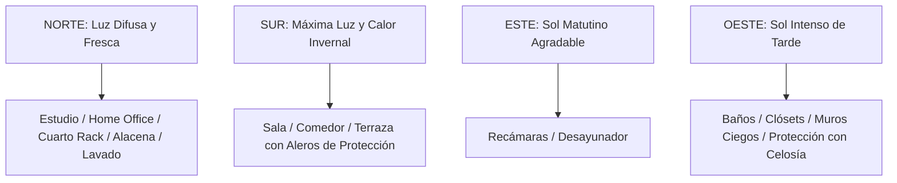

# Estándares Arquitectónicos y Antropometría: Ernst Neufert
**Proyecto:** Residencia Inteligente  
**Referencia:** *El Arte de Proyectar en Arquitectura (Bauentwurfslehre) — Ernst Neufert*

Este documento establece las dimensiones mínimas, óptimas y funcionales para cada espacio, basadas en la escala humana, la ergonomía y la eficiencia espacial.

---

## 1. Antropometría y Circulaciones Humanas

```
┌────────────────────────────────────────────────────────┐
│  MEDIDAS BASE DE CIRCULACIÓN (NEUFERT):               │
│                                                        │
│  • Paso de 1 persona:            0.80 m a 0.90 m       │
│  • Cruce de 2 personas:          1.20 m a 1.30 m       │
│  • Cruce con carga / maletas:    1.50 m                │
│  • Paso de servicio lateral:     0.60 m                │
│  • Altura libre de puertas:      2.10 m a 2.40 m       │
│  • Altura libre de piso a techo: 2.70 m a 3.00 m       │
└────────────────────────────────────────────────────────┘
```

---

## 2. Escaleras y Circulaciones Verticales

### Ley de Blondel (Comodidad del Paso Humano):
$$2 \times \text{Contrahuella (Peralte)} + \text{Huella} = 63\text{ a }65\text{ cm}$$

* **Contrahuella (Peralte):** $16.5\text{ a }17.5\text{ cm}$ (máximo $18.0\text{ cm}$ para vivienda cómoda).
* **Huella:** $28.0\text{ a }30.0\text{ cm}$ (para apoyo total de la planta del pie).
* **Ancho libre de escalera:** Mínimo $0.90\text{ m}$; óptimo $1.05\text{ a }1.20\text{ m}$.
* **Gálibo (Altura libre vertical de paso):** Mínimo $2.15\text{ m}$ libres sin vigas que golpeen la cabeza.
* **Descanso intermedio:** Mínimo igual al ancho de la escalera ($0.90\text{ a }1.10\text{ m}$) cada 12 a 16 escalones.

---

## 3. Dimensionamiento Óptimo por Espacio

### A. Cochera / Estacionamiento
* **1 Auto:** Mínimo $2.50\text{ m} \times 5.00\text{ m}$ | Óptimo $3.00\text{ m} \times 5.50\text{ m}$.
* **2 Autos en batería:** Mínimo $5.00\text{ m} \times 5.00\text{ m}$ | Óptimo $5.50\text{ m} \text{ a } 6.00\text{ m} \times 5.50\text{ m} \text{ a } 6.00\text{ m}$.
* **Holgura para abrir puertas:** Mínimo $0.60\text{ a }0.80\text{ m}$ entre vehículos y contra muros.

### B. Cocina y Lavandería (El Triángulo de Trabajo)
* **Triángulo Funcional:**
  * Almacenamiento (Refrigerador) $\leftrightarrow$ Lavado (Fregadero) $\leftrightarrow$ Cocción (Estufa).
  * La suma de las 3 distancias debe estar entre **$4.00\text{ m}$ y $7.50\text{ m}$** para evitar fatiga innecesaria.
* **Altura de encimeras/mesetas:** $90\text{ a }92\text{ cm}$.
* **Profundidad de barra de trabajo:** $60\text{ a }65\text{ cm}$ ($90\text{ a }100\text{ cm}$ en islas con desayunador).
* **Pasillo libre en cocina:** Mínimo $1.00\text{ m}$ (1 cocinero); óptimo $1.20\text{ a }1.30\text{ m}$ (para abrir el horno o lavavajillas y permitir que otra persona pase).

### C. Comedor y Sala de Estar
* **Comedor:**
  * Espacio por comensal en mesa: Ancho $60\text{ a }70\text{ cm}$, profundidad $40\text{ cm}$.
  * Borde de mesa a pared: Mínimo $85\text{ cm}$ para retirar la silla; $1.10\text{ a }1.20\text{ m}$ para permitir el paso de alguien sirviendo.
* **Sala:**
  * Distancia sofá a mesa de centro: $40\text{ a }45\text{ cm}$.
  * Distancia de visión a TV 4K: $2.20\text{ a }3.20\text{ m}$ para pantallas de 65" a 75".
  * Pasillo de circulación principal: Mínimo $0.90\text{ a }1.00\text{ m}$.

### D. Dormitorios y Clósets
* **Holgura perimetral de cama:** Mínimo $65\text{ a }75\text{ cm}$ a los lados; óptimo $85\text{ a }100\text{ cm}$.
* **Profundidad de clóset para colgar:** $60\text{ cm}$ útiles.
* **Espacio frente a clóset:** Mínimo $90\text{ cm}$ para abrir puertas batientes y vestirse.
* **Vestidor (Walk-in Closet):** Pasillo central libre de $90\text{ a }110\text{ cm}$ entre muebles.

### E. Baños y Sanitarios
* **Medio Baño de Visitas:** Mínimo $0.90\text{ m} \times 1.40\text{ m} = 1.26\text{ m}^2$ | Óptimo $1.10\text{ m} \times 1.60\text{ m}$.
* **Inodoro:** Espacio frontal libre mínimo $60\text{ cm}$, separación lateral mínima de $20\text{ cm}$ a cada lado (eje del WC a muro: $40\text{ a }45\text{ cm}$).
* **Regadera:** Mínimo $0.80\text{ m} \times 0.80\text{ m}$ | Óptimo $0.90\text{ m} \times 1.20\text{ m} \text{ a } 1.50\text{ m}$.

---

## 4. Zonificación Bioclimática y Orientaciones Solares


